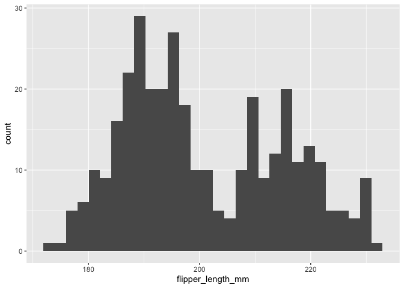
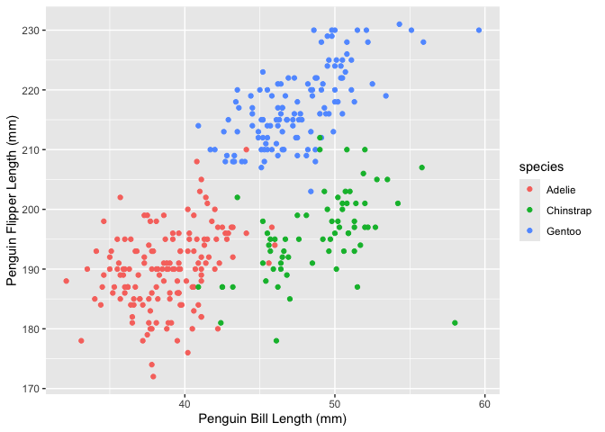

P8105_HW1_KJF2152.Rmd
================
Kaleb J. Frierson
2024-09-14

- [Library Calling](#library-calling)
- [Problem 1](#problem-1)
  - [Loading Data](#loading-data)
  - [Viewing Data](#viewing-data)
  - [Describing Data](#describing-data)
  - [Visualizing Data](#visualizing-data)

# Library Calling

``` r
library(ggplot2)
```

# Problem 1

## Loading Data

The “penguins” dataset is within the “palmerpenguins” package which I
installed in the console. In the below chunk I load the dataset using
the data function.

``` r
data("penguins", package = "palmerpenguins")
```

## Viewing Data

In the next chunk I will use the heads function to view the top few rows
and all of the columns, the nrow function to get a count of rows, the
ncol function to get a count of columns, and the summary function to see
sumary statistics for each of the variables.

``` r
head(penguins)
```

    ## # A tibble: 6 × 8
    ##   species island    bill_length_mm bill_depth_mm flipper_length_mm body_mass_g
    ##   <fct>   <fct>              <dbl>         <dbl>             <int>       <int>
    ## 1 Adelie  Torgersen           39.1          18.7               181        3750
    ## 2 Adelie  Torgersen           39.5          17.4               186        3800
    ## 3 Adelie  Torgersen           40.3          18                 195        3250
    ## 4 Adelie  Torgersen           NA            NA                  NA          NA
    ## 5 Adelie  Torgersen           36.7          19.3               193        3450
    ## 6 Adelie  Torgersen           39.3          20.6               190        3650
    ## # ℹ 2 more variables: sex <fct>, year <int>

``` r
nrow(penguins)
```

    ## [1] 344

``` r
ncol(penguins)
```

    ## [1] 8

``` r
summary(penguins)
```

    ##       species          island    bill_length_mm  bill_depth_mm  
    ##  Adelie   :152   Biscoe   :168   Min.   :32.10   Min.   :13.10  
    ##  Chinstrap: 68   Dream    :124   1st Qu.:39.23   1st Qu.:15.60  
    ##  Gentoo   :124   Torgersen: 52   Median :44.45   Median :17.30  
    ##                                  Mean   :43.92   Mean   :17.15  
    ##                                  3rd Qu.:48.50   3rd Qu.:18.70  
    ##                                  Max.   :59.60   Max.   :21.50  
    ##                                  NA's   :2       NA's   :2      
    ##  flipper_length_mm  body_mass_g       sex           year     
    ##  Min.   :172.0     Min.   :2700   female:165   Min.   :2007  
    ##  1st Qu.:190.0     1st Qu.:3550   male  :168   1st Qu.:2007  
    ##  Median :197.0     Median :4050   NA's  : 11   Median :2008  
    ##  Mean   :200.9     Mean   :4202                Mean   :2008  
    ##  3rd Qu.:213.0     3rd Qu.:4750                3rd Qu.:2009  
    ##  Max.   :231.0     Max.   :6300                Max.   :2009  
    ##  NA's   :2         NA's   :2

## Describing Data

The penguin dataset has 344 rows each representing an individual
penguin. The 8 columns include the following variables: Species, Island,
Bill Length in mm, Bill Depth in mm, Flipper Length in mm, Body Mass in
g, Sex, and Year of recording.

The mean flipper length is 200.9 mm; however, the distribution of
flipper length is multimodal. Thus, the Median (197.0) might be a better
measure of central tendency. I determined this by graphing the variable
with a histogram in the chunk below.

``` r
ggplot(penguins, aes(x=flipper_length_mm))+ geom_histogram()
```

    ## `stat_bin()` using `bins = 30`. Pick better value with `binwidth`.

    ## Warning: Removed 2 rows containing non-finite outside the scale range
    ## (`stat_bin()`).

<!-- -->

## Visualizing Data

In the following chunk I create a scatterplot of flipper_length_mm (y)
vs bill_length_mm (x) and color points by species.

``` r
ggplot(penguins,aes(x=bill_length_mm, y=flipper_length_mm, color=species))+
  geom_point()+
  labs(x= "Penguin Bill Length (mm)", y= "Penguin Flipper Length (mm)")
```

    ## Warning: Removed 2 rows containing missing values or values outside the scale range
    ## (`geom_point()`).

<!-- --> \##
Saving Plot

Using ggsave I tell R to save this plot as a png file within the figures
folder of this project.

``` r
ggsave("Figures/penguin_plot.png")
```

    ## Saving 7 x 5 in image

    ## Warning: Removed 2 rows containing missing values or values outside the scale range
    ## (`geom_point()`).
